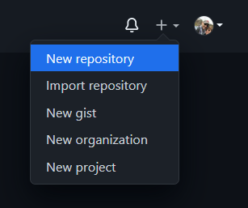
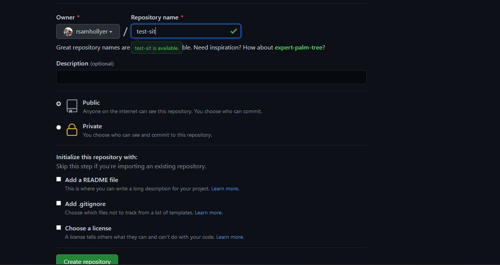
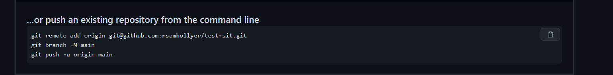
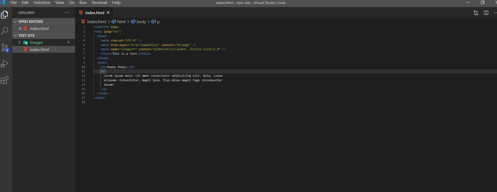
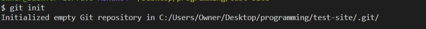
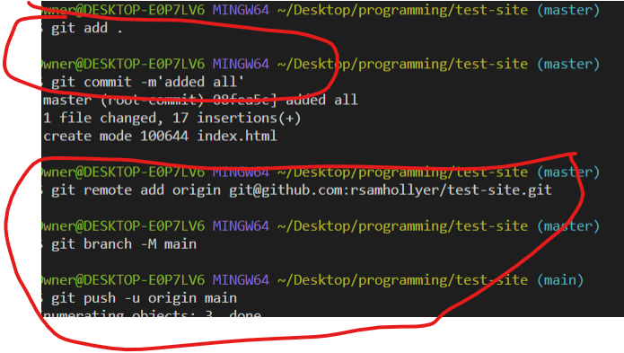
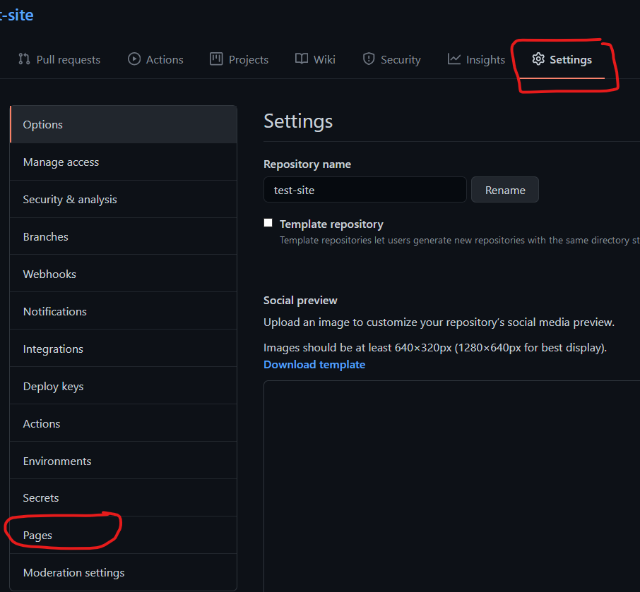

# Publish Static Website to Github Pages

I wanted to try and make this simple walkthrough to publish a simple webpage using Github Pages.
Hopefully this helps y'all out while you're getting ready for class. I am assuming you all have a
[GitHub](https://github.com) account and have installed [VsCode](https://code.visualstudio.com/download).
If not then do so! If you're using another IDE rather than VsCode I'm probably not going to be able to help much and encourage you to do so; unless DC requires you to anyways! =D

## Steps

1. Create a new repo. There are many places to do this, but this is where I usually go to:
   

2. Give your repo a name, make sure it's public (I believe this is the default position), do NOT add a Readme. You want to add and write your own markdown as you're working. Then hit the create button.
   

3. You'll be redirected to a page that has several panels full of pre-fabricated code. Stay on this page; you'll be running the 3 lines of code seen below in your own command line.
   

4. Create a local directory with the same name as your repo. For example "test-site" is the name of my local directory and my github repo. Open it in vscode and created your HTML page. Quick note : the "!" is an Emmet abbreviation to quickly lay down the HTML "Boiler Plate".
   

5. After creating your static page, or before, whatever!, open your command line (CLI) and make sure it's in your working directory. Type ` git init` to create a `.git` repository inside your working directory. This will allow you to send pushes to github repos.

   

6. You're going to run to sets of commands. First, lets prepare our files for pushing. `git add . ` will add all the files that have changed in your working directory as one single staged push. Defer to what Sean will teach about what and how to add files. Then run `git commit -m "<message>"`. This should NOT be a large amount of text. Usually keep it short and sweet. What I do is think "This commit will...." "add some file" "remove some code" etc. Now, remember those three lines of code from git hub? Copy and paste them, sometimes you can do it all at once, sometimes only one line at a time.
   

7. Now go to the github repository dashboard. It should default to the `<>Code` link. Please ignore the config file as that is put in there by github when you publish your site

8. Mosey on over to `Settings` link and find `Pages`
   

9. Finally publish your site. You will choose `main` or `master` branch (or whatever your origin is named) and point github to the root of your repo, or where ever you placed your `index.html` file. (It really should be in the root directory).

10. Click on the link and view your masterpiece! This usually takes a while. For me, it was about 4 minutes. YMMV
